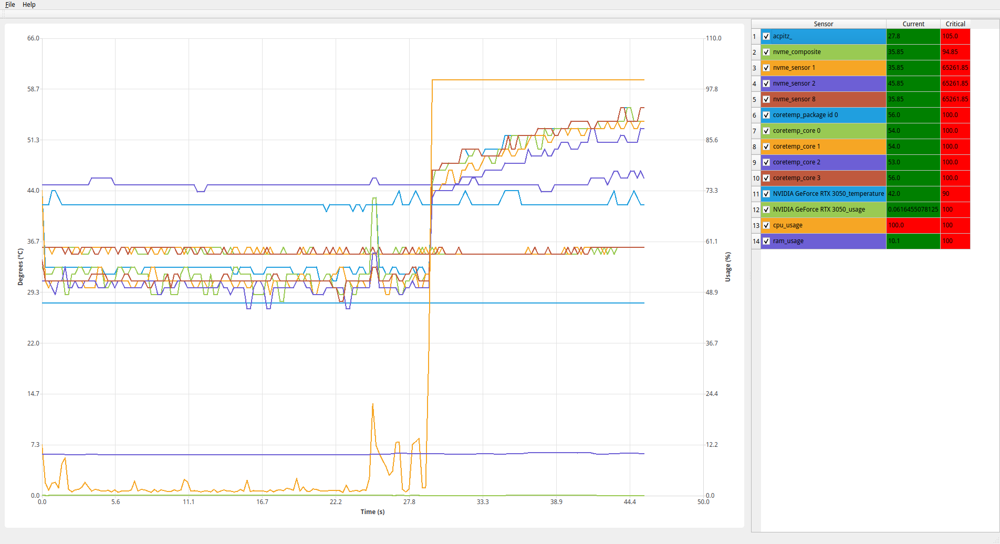

# QSensor

QSensor is a graphical hardware temperature and usage monitor. It can monitor motherboard, SSD, and Nvidia GPU temperature along with CPU, RAM, and Nvidia GPU usage thanks to PSutil and GPUtil.

Each sensor's curve can be visualized in a graph and exported in JSON format. The optimum range can be determined, and an alarm is triggered in case of critical temperature.

## Feature
Bellow a list of features that are planned:
- [x] Cpu sensors
- [x] Nvidia GPU sensors
- [ ] AMD GPU sensors
- [x] Memory usage
- [x] Cpu usage
- [x] Exportation to JSON
- [x] Chart
- [x] Binary release
- [x] Tray integration
- [x] Tray alarm for critical temperature
- [x] Rubber band zoom
